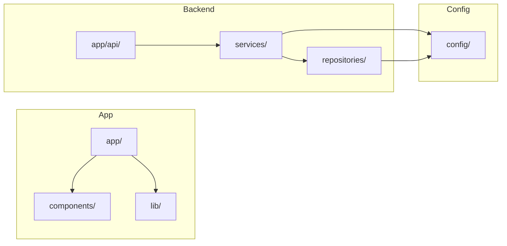
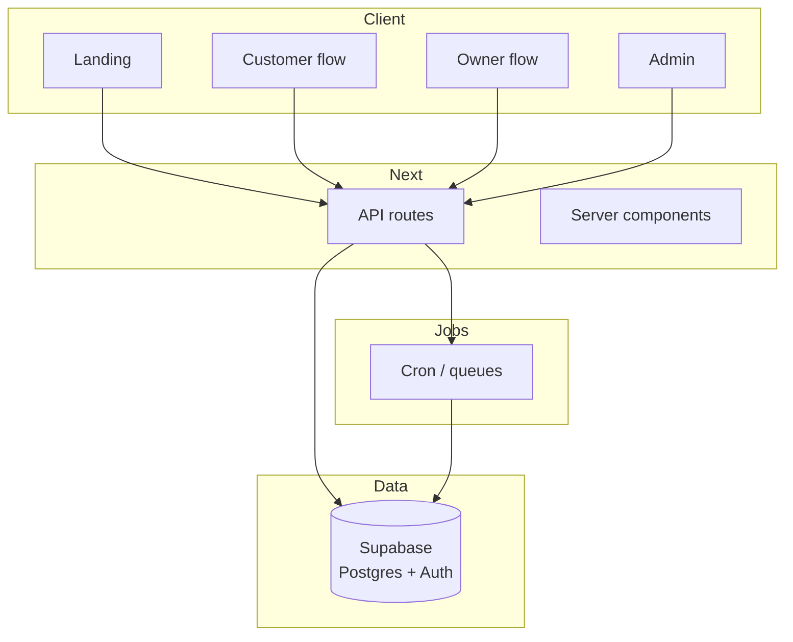
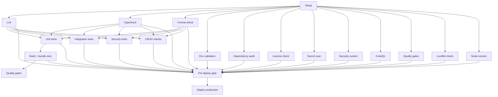

<div align="center">

# CusOwn

**A [Clykur](https://clykur.com) product**


A modern booking platform for service businesses. Customers discover businesses, book slots, and get confirmations; owners manage availability and bookings. Built with Next.js (App Router), Supabase, and TypeScript.

</div>

---

## Product at a glance

<p align="center">
  
  
  
  
  <br />
  
  
  
  
  
  <br />
  
  
  
  
  
</p>

_Metrics from this repository only. Product-led: every number reflects shipped surface area, test coverage, and pipeline rigor. User, business, and platform metrics (users, businesses, bookings, growth) are tracked in the admin dashboard from live data—no fake counts._

---

**For interns & new contributors:** This README explains what the codebase does, which commands to use, and how the pipeline works. Use the command index and diagrams below.

---

## Table of contents

- [Product at a glance](#product-at-a-glance)
- [What this codebase does](#what-this-codebase-does)
- [Tech stack](#tech-stack)
- [Repository structure](#repository-structure)
- [High-level architecture](#high-level-architecture)
- [CI/CD pipeline](#cicd-pipeline)
- [Prerequisites & setup](#prerequisites--setup)
- [Command reference](#command-reference)
- [Environment & config](#environment--config)
- [Key paths for development](#key-paths-for-development)
- [Notes & conventions](#notes--conventions)

---

## What this codebase does

- **Landing & auth:** Public landing page, sign-in (e.g. Google), role selection (customer / owner).
- **Customer flow:** Browse categories (e.g. salon), pick a business, choose a slot, book, get confirmation (e.g. WhatsApp).
- **Owner flow:** Onboarding, business setup, slot and booking management, analytics, QR/booking link.
- **Admin:** Dashboard, users, businesses, bookings, audit logs, success metrics, CodeQL/security.
- **Backend:** REST APIs under `app/api/`, Supabase (Postgres + Auth), state machines for booking/slot/payment, cron for expiry and health.

**Invariants (do not break):** One confirmed booking per slot (DB-enforced). Booking lifecycle: state machine only (`pending` → `confirm` | `reject` | `cancel` | `expire`). Payment is optional; booking can be confirmed without payment.

---

## Tech stack

| Layer     | Technology                                                                                               |
| --------- | -------------------------------------------------------------------------------------------------------- |
| Framework | Next.js 15 (App Router)                                                                                  |
| Backend   | Supabase (Postgres, Auth, Service Role)                                                                  |
| Language  | TypeScript                                                                                               |
| API       | Route handlers in `app/api/**/route.ts`; `successResponse` / `errorResponse` from `@/lib/utils/response` |
| State     | State machines in `lib/state/` (booking, payment, slot); Zustand on client where needed                  |
| Styling   | Tailwind CSS                                                                                             |
| Tests     | Vitest, ts-node for scripts, unit + integration + security + CRUD suites                                 |

---

## Repository structure

```
CusOwn/
├── app/                    # Next.js App Router (pages, layouts, API routes)
│   ├── api/                # REST API route handlers
│   ├── (dashboard)/        # Dashboard layouts: admin, owner, customer
│   ├── customer/           # Customer-facing pages (browse, book)
│   ├── auth/               # Login, callback
│   ├── select-role/        # Role selection after sign-in
│   └── page.tsx            # Landing page
├── components/             # React components (UI, admin, booking, customer)
├── config/                 # Constants, env, policies (constants.ts, env.ts, *.policy.ts)
├── lib/                    # Shared lib: auth, security, state, utils, realtime, prefetch
├── services/               # Business logic (booking, audit, payment)
├── repositories/           # Data access (slot, booking, etc.)
├── middleware.ts           # Next.js middleware (auth, redirects)
├── scripts/                # Tests, e2e, integration, security, infrastructure
│   ├── api-routes/         # API unit tests
│   ├── integration/        # Integration & DB tests
│   ├── security/           # Security test suites
│   ├── e2e/                # E2E / journey tests
│   └── infrastructure/     # CI/guard scripts (ensure-env-test, run-detect-secrets, etc.)
└── .github/workflows/      # CI/CD (ci.yml = main pipeline)
```



---

## High-level architecture



- **Customer:** Browse → business page → slot picker → book → confirmation.
- **Owner:** Setup business → manage slots & bookings → analytics / QR.
- **Admin:** Dashboard, users, businesses, bookings, audit, security.

---

## CI/CD pipeline

All checks run in a **single pipeline** (`.github/workflows/ci.yml`). Nothing is skipped for speed.



**Jobs (what runs in CI):**

| Job                         | What it does                                                      |
| --------------------------- | ----------------------------------------------------------------- |
| **Setup**                   | Checkout, Node, cache `node_modules`, `npm ci`                    |
| **Env validation**          | Ensure `.env.test`, run `verify-env`, node version check          |
| **Lint**                    | `npm run lint:strict`                                             |
| **Typecheck**               | `npm run typecheck`                                               |
| **Format check**            | `npm run format:check` (Prettier)                                 |
| **Dependency audit**        | `security:audit`, `security:deps`                                 |
| **License check**           | Production license check                                          |
| **Secret scan**             | Gitleaks / detect-secrets                                         |
| **Security custom**         | Custom security rules + `security-check`                          |
| **CodeQL**                  | SAST (security-extended), SARIF upload                            |
| **Unit tests**              | ts-node unit suite + Vitest unit + coverage (thresholds enforced) |
| **Integration tests**       | unit-database + database-migrations                               |
| **Security tests**          | phase4, phase5, phase6                                            |
| **CRUD checks**             | `test:crud` (unit-repositories + database-migrations)             |
| **Build**                   | `build:strict` + bundle size check                                |
| **Quality gates**           | depcheck, ts-prune                                                |
| **Lockfile / Node version** | Lockfile + node version scripts                                   |
| **Pre-deploy gate**         | All of the above must pass                                        |
| **Deploy production**       | Main only; Vercel prod deploy                                     |

---

## Prerequisites & setup

- **Node.js** `22.x` recommended (project supports `>=20 <23`).
- **npm** `10+`.
- **Python 3** + `pip install detect-secrets` for local secret scan (`npm run security:gitleaks`).

### Setup (macOS / Linux)

```bash
# From project root
node -v   # expect 20.x or 22.x
npm -v    # expect 10+

# Optional: nvm
nvm install 22
nvm use 22

npm ci
```

### Setup (Windows PowerShell)

```powershell
node -v
npm -v
# Optional: nvm-windows
nvm install 22.22.0
nvm use 22.22.0
npm ci
```

### First-time env

- Copy `env.template` (or equivalent) to `.env.local` and fill Supabase (and any other) keys.
- For tests, `.env.test` is created by `node scripts/infrastructure/ensure-env-test.js` (or by CI).

---

## Command reference

Use these commands locally. CI runs the same checks via the workflow above.

### Development

| Command                | Description                                               |
| ---------------------- | --------------------------------------------------------- |
| `npm run dev`          | Start Next.js dev server (predev runs node version check) |
| `npm run dev:clean`    | Clean caches + `npm run dev`                              |
| `npm run dev:fresh`    | `npm run clean` + `npm run dev`                           |
| `npm run build`        | Production build                                          |
| `npm run build:strict` | Strict build into `.next-build` (used in CI)              |
| `npm run build:fresh`  | Clean artifacts + strict build                            |
| `npm run start`        | Run production server                                     |
| `npm run clean`        | Remove `.next`, `.next-build`, coverage artifacts         |
| `npm run clean:all`    | Same as `clean`                                           |

### Lint, typecheck, format

| Command                | Description                                                                         |
| ---------------------- | ----------------------------------------------------------------------------------- |
| `npm run lint`         | Next.js ESLint                                                                      |
| `npm run lint:strict`  | ESLint on app, components, lib, services, repositories, middleware (max-warnings=0) |
| `npm run typecheck`    | `tsc --noEmit` with typecheck config                                                |
| `npm run format:check` | Prettier check (no write) on app, components, lib, config                           |
| `npm run format`       | Prettier format (write)                                                             |

### Tests

| Command                               | Description                                                           |
| ------------------------------------- | --------------------------------------------------------------------- |
| `npm run test:unit`                   | ts-node unit suite with `.env.test`                                   |
| `npm run test:unit:vitest`            | Vitest unit tests + coverage (thresholds in `vitest.unit.config.mts`) |
| `npm run test:crud`                   | CRUD: unit-repositories + database-migrations (used in CI)            |
| `npm run test:integration`            | Vitest: unit-database + integration                                   |
| `npm run test:api-routes`             | Vitest API route tests                                                |
| `npm run test:database-migrations`    | DB migration / schema tests                                           |
| `npm run test:phase4` … `test:phase9` | Phase-specific security/e2e suites                                    |
| `npm run test:all`                    | Full scripted test run (`scripts/run-all-tests.sh`)                   |

### Security

| Command                            | Description                                                                       |
| ---------------------------------- | --------------------------------------------------------------------------------- |
| `npm run security-check`           | Pre-push check: package-lock present, no dangerous patterns in app/lib/components |
| `npm run security:audit`           | `npm audit` (high, omit dev)                                                      |
| `npm run security:deps`            | Same as audit                                                                     |
| `npm run security:gitleaks`        | Secret scan (detect-secrets; requires Python + detect-secrets)                    |
| `npm run security:gitleaks:staged` | Secret scan on staged files only                                                  |
| `npm run security:custom:repo`     | Custom security/quality validation (repo-wide)                                    |
| `npm run security:custom:staged`   | Custom validation on staged files                                                 |

### Quality

| Command                       | Description                                            |
| ----------------------------- | ------------------------------------------------------ |
| `npm run quality:depcheck`    | Unused dependencies (depcheck)                         |
| `npm run quality:ts-prune`    | Unused exports (ts-prune)                              |
| `npm run quality:bundle-size` | Fail if `.next` bundle exceeds limit (run after build) |
| `npm run quality:license`     | License check (production deps)                        |

### One-command guard (pre-push / local CI)

| Command             | Description                                                                                                                                                                           |
| ------------------- | ------------------------------------------------------------------------------------------------------------------------------------------------------------------------------------- |
| `npm run guard:all` | Full guard: .env.test, lockfile, lint, typecheck, secret scan, security custom, security-check, audit, deps, unit tests (ts-node + Vitest), quality gates, build. Use before pushing. |

### Git hooks (Husky)

| Command                    | Description                                                                               |
| -------------------------- | ----------------------------------------------------------------------------------------- |
| `npm run precommit:strict` | Lint-staged + lint:strict + typecheck + security:gitleaks:staged + security:custom:staged |
| `npm run prepush:strict`   | Same as `guard:all`                                                                       |

### Config & env

| Command                                          | Description                                                                                         |
| ------------------------------------------------ | --------------------------------------------------------------------------------------------------- |
| `npm run verify-env`                             | Check required env vars (use with `.env.test`: `npx dotenv-cli -e .env.test -- npm run verify-env`) |
| `node scripts/infrastructure/ensure-env-test.js` | Create `.env.test` with placeholders if missing                                                     |

### Infrastructure / CI helpers

| Command                                             | Description                |
| --------------------------------------------------- | -------------------------- |
| `node scripts/infrastructure/check-lockfile.js`     | Lockfile consistency       |
| `node scripts/infrastructure/check-node-version.js` | Node version check         |
| `node scripts/infrastructure/run-license-check.js`  | License check (used in CI) |

---

## Environment & config

- **Env:** Use `config/env.ts` in code; no raw `process.env` in business logic. Required vars (e.g. Supabase URL, anon key, service role) are documented in `env.template` or equivalent.
- **Constants:** `config/constants.ts` (e.g. `ERROR_MESSAGES`, `SUCCESS_MESSAGES`, rate limits). No magic numbers or hardcoded user-facing strings in app/lib/components.
- **Policies:** `config/*.policy.ts` — phase/scope; do not change without approval.

---

## Key paths for development

| Purpose               | Path                                                                  |
| --------------------- | --------------------------------------------------------------------- |
| API responses         | `lib/utils/response.ts` (`successResponse`, `errorResponse`)          |
| Constants / messages  | `config/constants.ts`, `config/env.ts`                                |
| Booking state machine | `lib/state/` (booking, slot, payment)                                 |
| Booking service       | `services/booking.service.ts`                                         |
| Audit / security      | `services/audit.service.ts`, `lib/security/`, `lib/utils/security.ts` |
| Slot/booking data     | `repositories/slot.repository.ts`, booking repositories               |
| Customer booking UI   | `app/customer/`, `components/booking/` (e.g. public-booking-page)     |
| Admin dashboard       | `app/(dashboard)/admin/`                                              |
| CI pipeline           | `.github/workflows/ci.yml`                                            |
| Local guard           | `scripts/infrastructure/run-enterprise-guard.js`                      |

---

## Notes & conventions

- **Logging:** Dev `console.log`/debug/trace only where intended; production strips them (warn/error remain).
- **Strict build:** Uses isolated output (e.g. `.next-build`) to avoid mixing with dev.
- **Security:** No unauthenticated state mutation; cron needs `CRON_SECRET`; admin needs `checkIsAdmin` and rate limit. See `.cursor/rules` and `config/*.policy.ts` for full rules.
- **Pre-push:** Run `npm run guard:all` (or `npm run prepush:strict`) and fix any failures before pushing. CI runs the same validations.

---

## Quick start for interns

1. **Clone and install:** `npm ci`
2. **Env:** Create `.env.local` from template; run `node scripts/infrastructure/ensure-env-test.js` for tests.
3. **Dev:** `npm run dev` → open http://localhost:3000
4. **Before pushing:** `npm run guard:all` (or at least `npm run lint:strict`, `npm run typecheck`, `npm run security-check`).
5. **Navigate:** Use the [Repository structure](#repository-structure) and [Key paths](#key-paths-for-development) above; read `config/constants.ts` and `config/env.ts` for shared config.

---

<div align="center">

**Made with <span style="color:#dc2626;">❤️</span> — Team Clykur**

</div>
