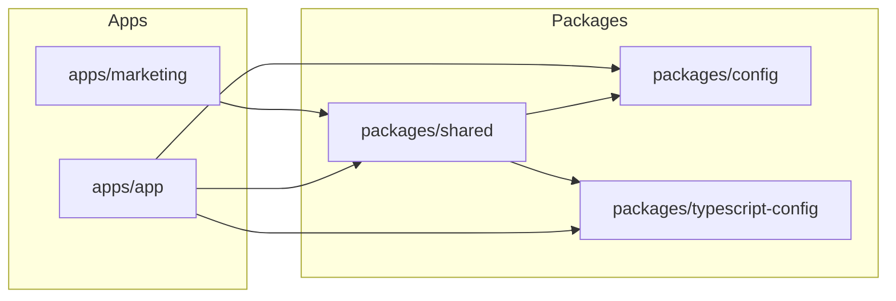
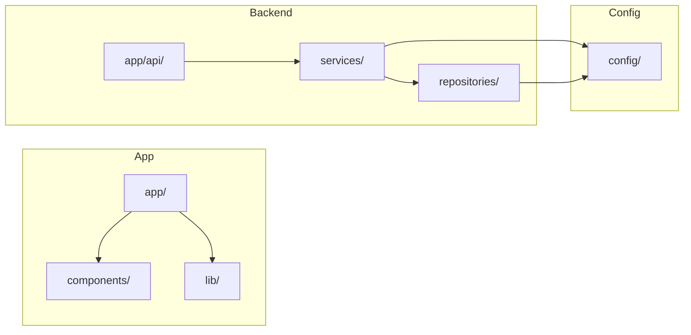
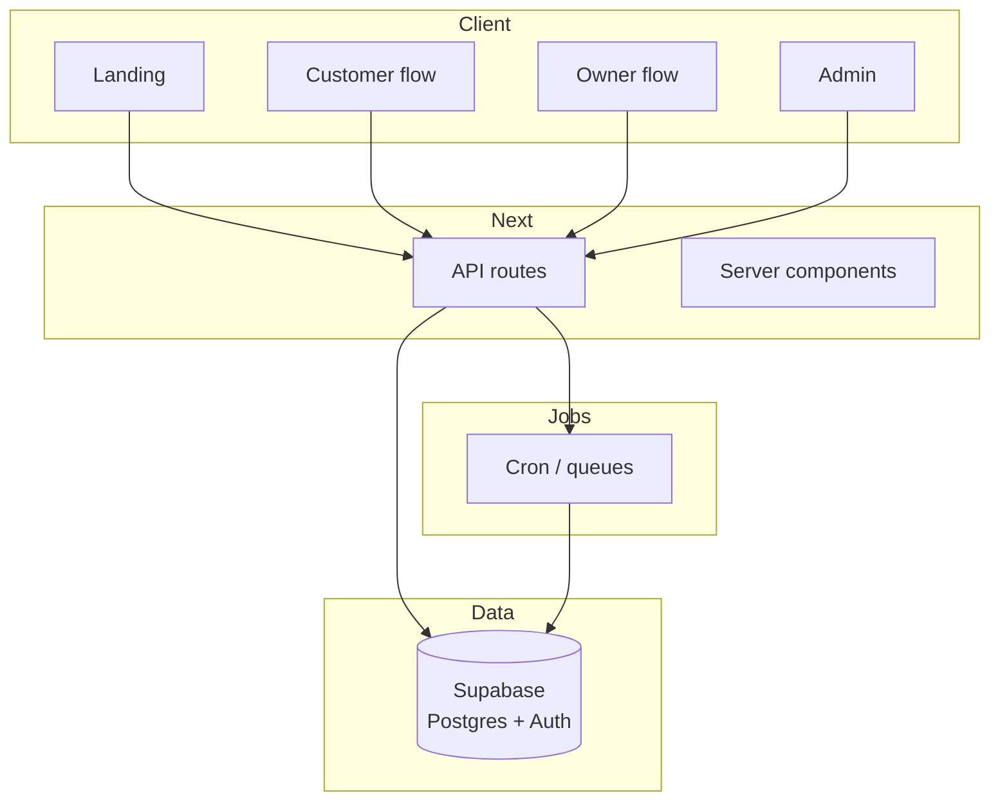
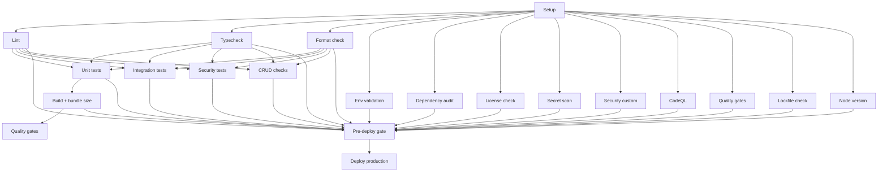

<div align="center">

# CusOwn

**A [Clykur](https://clykur.com) product**


A modern booking platform for service businesses. Customers discover businesses, book slots, and get confirmations; owners manage availability and bookings. Built with Next.js (App Router), Supabase, and TypeScript.

</div>

---

## Product at a glance

<p align="center">
  
  
  
  
  <br />
  
  
  
  
  
  <br />
  
  
  
  
  
</p>

_Metrics from this repository only. Product-led: every number reflects shipped surface area, test coverage, and pipeline rigor. User, business, and platform metrics (users, businesses, bookings, growth) are tracked in the admin dashboard from live data—no fake counts._

---

**For interns & new contributors:** This README explains what the codebase does, which commands to use, and how the pipeline works. Use the command index and diagrams below.

---

## Table of contents

- [Product at a glance](#product-at-a-glance)
- [What this codebase does](#what-this-codebase-does)
- [Tech stack](#tech-stack)
- [Repository structure](#repository-structure)
- [High-level architecture](#high-level-architecture)
- [CI/CD pipeline](#cicd-pipeline)
- [Prerequisites & setup](#prerequisites--setup)
- [Command reference](#command-reference)
- [Environment & config](#environment--config)
- [Key paths for development](#key-paths-for-development)
- [Notes & conventions](#notes--conventions)

---

## What this codebase does

- **Landing & auth:** Public landing page, sign-in (e.g. Google), role selection (customer / owner).
- **Customer flow:** Browse categories (e.g. salon), pick a business, choose a slot, book, get confirmation (e.g. WhatsApp).
- **Owner flow:** Onboarding, business setup, slot and booking management, analytics, QR/booking link.
- **Admin:** Dashboard, users, businesses, bookings, audit logs, success metrics, CodeQL/security.
- **Backend:** REST APIs under `app/api/`, Supabase (Postgres + Auth), state machines for booking/slot/payment, cron for expiry and health.

**Invariants (do not break):** One confirmed booking per slot (DB-enforced). Booking lifecycle: state machine only (`pending` → `confirm` | `reject` | `cancel` | `expire`). Payment is optional; booking can be confirmed without payment.

---

## Tech stack

| Layer         | Technology                                                                                               |
| ------------- | -------------------------------------------------------------------------------------------------------- |
| Monorepo      | Turbo, npm workspaces                                                                                    |
| Framework     | Next.js 15 (App Router)                                                                                  |
| Backend       | Supabase (Postgres, Auth, SSR)                                                                           |
| Language      | TypeScript                                                                                               |
| Shared Logic  | `@cusown/shared` package (services, repositories, lib)                                                   |
| Config        | `@cusown/config` package (constants, env, flags)                                                         |
| Tests         | Vitest, ts-node unit suites                                                                              |

---

## Repository structure

The project is a **Turbo monorepo** managed with **npm workspaces**.

```
CusOwn/
├── apps/
│   ├── app/                # Core Booking Platform (Next.js 15)
│   │   ├── app/            # App Router (pages, layouts, API routes)
│   │   ├── components/     # App-specific UI components
│   │   └── public/         # App-specific static assets
│   └── marketing/          # Marketing Website (Next.js 15)
├── packages/
│   ├── shared/             # Shared logic, UI components, services, and types
│   │   └── src/            # Shared source code (lib, services, repositories)
│   ├── config/             # Centralized constants, env, and feature flags
│   └── typescript-config/  # Shared TypeScript configurations
├── scripts/                # Utility scripts (database, CI, security, tests)
│   ├── api-routes/         # API unit tests
│   ├── integration/        # Integration & DB tests
│   ├── security/           # Security test suites
│   └── infrastructure/     # CI/guard scripts (env validation, security scans)
└── .github/workflows/      # CI/CD pipeline definitions
```


```mermaid
flowchart LR
  subgraph Apps
    APP[apps/app]
    MKT[apps/marketing]
  end
  subgraph Packages
    SHR[packages/shared]
    CFG[packages/config]
    TSC[packages/typescript-config]
  end
  APP --> SHR
  MKT --> SHR
  SHR --> CFG
  APP --> CFG
  APP --> TSC
  SHR --> TSC
```


```mermaid
flowchart LR
  subgraph App
    A[app/]
    B[components/]
    C[lib/]
  end
  subgraph Backend
    D[services/]
    E[repositories/]
    F[app/api/]
  end
  subgraph Config
    G[config/]
  end
  A --> B
  A --> C
  F --> D
  D --> E
  D --> G
  E --> G
```

---

## High-level architecture


```mermaid
flowchart TB
  subgraph Client
    LP[Landing]
    CF[Customer flow]
    OF[Owner flow]
    AD[Admin]
  end
  subgraph Next
    API[API routes]
    RSC[Server components]
  end
  subgraph Data
    SB[(Supabase\nPostgres + Auth)]
  end
  subgraph Jobs
    CRON[Cron / queues]
  end
  LP --> API
  CF --> API
  OF --> API
  AD --> API
  API --> SB
  API --> CRON
  CRON --> SB
```

- **Customer:** Browse → business page → slot picker → book → confirmation.
- **Owner:** Setup business → manage slots & bookings → analytics / QR.
- **Admin:** Dashboard, users, businesses, bookings, audit, security.

---

## CI/CD pipeline

All checks run in a **single pipeline** (`.github/workflows/ci.yml`). Nothing is skipped for speed.


```mermaid
flowchart TB
  S[Setup]
  S --> L[Lint]
  S --> T[Typecheck]
  S --> F[Format check]
  S --> E[Env validation]
  S --> DA[Dependency audit]
  S --> LC[License check]
  S --> SS[Secret scan]
  S --> SC[Security custom]
  S --> CQ[CodeQL]
  L --> UT[Unit tests]
  T --> UT
  F --> UT
  L --> IT[Integration tests]
  T --> IT
  F --> IT
  L --> ST[Security tests]
  T --> ST
  F --> ST
  L --> CR[CRUD checks]
  T --> CR
  F --> CR
  UT --> B[Build + bundle size]
  B --> G[Quality gates]
  S --> QG[Quality gates]
  S --> LF[Lockfile check]
  S --> NV[Node version]
  UT --> PD[Pre-deploy gate]
  IT --> PD
  ST --> PD
  CR --> PD
  B --> PD
  QG --> PD
  LF --> PD
  NV --> PD
  DA --> PD
  LC --> PD
  SS --> PD
  SC --> PD
  CQ --> PD
  E --> PD
  F --> PD
  L --> PD
  T --> PD
  PD --> DP[Deploy production]
```

**Jobs (what runs in CI):**

| Job                         | What it does                                                      |
| --------------------------- | ----------------------------------------------------------------- |
| **Setup**                   | Checkout, Node, cache `node_modules`, `npm ci`                    |
| **Env validation**          | Ensure `.env.test`, run `verify-env`, node version check          |
| **Lint**                    | `npm run lint:strict`                                             |
| **Typecheck**               | `npm run typecheck`                                               |
| **Format check**            | `npm run format:check` (Prettier)                                 |
| **Dependency audit**        | `security:audit`, `security:deps`                                 |
| **License check**           | Production license check                                          |
| **Secret scan**             | Gitleaks / detect-secrets                                         |
| **Security custom**         | Custom security rules + `security-check`                          |
| **CodeQL**                  | SAST (security-extended), SARIF upload                            |
| **Unit tests**              | ts-node unit suite + Vitest unit + coverage (thresholds enforced) |
| **Integration tests**       | unit-database + database-migrations                               |
| **Security tests**          | phase4, phase5, phase6                                            |
| **CRUD checks**             | `test:crud` (unit-repositories + database-migrations)             |
| **Build**                   | `build:strict` + bundle size check                                |
| **Quality gates**           | depcheck, ts-prune                                                |
| **Lockfile / Node version** | Lockfile + node version scripts                                   |
| **Pre-deploy gate**         | All of the above must pass                                        |
| **Deploy production**       | Main only; Vercel prod deploy                                     |

---

## Prerequisites & setup

- **Node.js** `22.x` recommended (project supports `>=20 <23`).
- **npm** `10+`.
- **Python 3** + `pip install detect-secrets` for local secret scan (`npm run security:gitleaks`).

### Setup (macOS / Linux)

```bash
# From project root
node -v   # expect 20.x or 22.x
npm -v    # expect 10+

# Optional: nvm
nvm install 22
nvm use 22

npm ci
```

### Setup (Windows PowerShell)

```powershell
node -v
npm -v
# Optional: nvm-windows
nvm install 22.22.0
nvm use 22.22.0
npm ci
```

### First-time env

- Copy `env.template` (or equivalent) to `.env.local` and fill Supabase (and any other) keys.
- For tests, `.env.test` is created by `node scripts/infrastructure/ensure-env-test.js` (or by CI).

---

## Command reference

Use these commands from the root directory. Turbo will orchestrate the tasks across all workspaces.

### Development & Build

| Command             | Description                                               |
| ------------------- | --------------------------------------------------------- |
| `npm run dev`       | Start development servers for all apps via Turbo          |
| `npm run build`     | Build all applications and packages                       |
| `npm run start`     | Start production servers                                  |
| `npm run clean`     | Remove build artifacts (.next, dist, etc.)                |

### Quality & Testing

| Command               | Description                                                 |
| --------------------- | ----------------------------------------------------------- |
| `npm run lint`        | Run ESLint across the entire project                        |
| `npm run typecheck`   | Run TypeScript type checking across all workspaces          |
| `npm run test`        | Run all test suites using Turbo                             |
| `npm run format`      | Format all code using Prettier                              |
| `npm run format:check`| Verify code formatting without making changes               |

### Security & Auditing

| Command                  | Description                                                |
| ------------------------ | ---------------------------------------------------------- |
| `npm run security-check` | Full guard: lint, typecheck, test, and build               |
| `npm run guard:all`      | Comprehensive quality gate (used before pushing)           |
| `npm run security:audit` | Audit dependencies for security vulnerabilities            |

### Workspace Specifics

To run commands for a specific workspace, use the `--workspace` (or `-w`) flag:
- `npm run dev -w @cusown/app`
- `npm run build -w @cusown/shared`

### Config & env

| Command                                          | Description                                                                                         |
| ------------------------------------------------ | ----------------------------------------------------------------------------------- |
| `npm run verify-env`                             | Check required env vars (use with `.env.test`: `npx dotenv-cli -e .env.test -- npm run verify-env`) |
| `node scripts/infrastructure/ensure-env-test.js` | Create `.env.test` with placeholders if missing                                                     |

### Infrastructure / CI helpers

| Command                                             | Description                |
| --------------------------------------------------- | -------------------------- |
| `node scripts/infrastructure/check-lockfile.js`     | Lockfile consistency       |
| `node scripts/infrastructure/check-node-version.js` | Node version check         |
| `node scripts/infrastructure/run-license-check.js`  | License check (used in CI) |

---

## Environment & config

- **Env:** Use `config/env.ts` in code; no raw `process.env` in business logic. Required vars (e.g. Supabase URL, anon key, service role) are documented in `env.template` or equivalent.
- **Constants:** `config/constants.ts` (e.g. `ERROR_MESSAGES`, `SUCCESS_MESSAGES`, rate limits). No magic numbers or hardcoded user-facing strings in app/lib/components.
- **Policies:** `config/*.policy.ts` — phase/scope; do not change without approval.

---

## Key paths for development

| Purpose               | Path                                                                          |
| --------------------- | ----------------------------------------------------------------------------- |
| Shared logic / Utils  | `packages/shared/src/lib/`                                                    |
| Shared Services       | `packages/shared/src/services/`                                               |
| Shared Repositories   | `packages/shared/src/repositories/`                                           |
| Central Config        | `packages/config/src/` (constants, env)                                       |
| Main App UI           | `apps/app/app/`, `apps/app/components/`                                       |
| API Handlers (App)    | `apps/app/app/api/`                                                           |
| Marketing Site        | `apps/marketing/app/`                                                         |
| CI Pipeline           | `.github/workflows/ci.yml`                                                    |
| Local Quality Guard   | `scripts/infrastructure/run-quality-gate.js`                                  |

---

## Notes & conventions

- **Logging:** Dev `console.log`/debug/trace only where intended; production strips them (warn/error remain).
- **Strict build:** Cleans `.next` then runs `next build` (fail on warnings). Output is `.next`.
- **Security:** No unauthenticated state mutation; cron needs `CRON_SECRET`; admin needs `checkIsAdmin` and rate limit. See `.cursor/rules` and `config/*.policy.ts` for full rules.
- **Pre-push:** Run `npm run guard:all` (or `npm run prepush:strict`) and fix any failures before pushing. CI runs the same validations.

---

## Quick start for interns

1. **Clone and install:** `npm ci`
2. **Env:** Create `.env.local` from template; run `node scripts/infrastructure/ensure-env-test.js` for tests.
3. **Dev:** `npm run dev` → open http://localhost:3000
4. **Before pushing:** `npm run guard:all` (or at least `npm run lint:strict`, `npm run typecheck`, `npm run security-check`).
5. **Navigate:** Use the [Repository structure](#repository-structure) and [Key paths](#key-paths-for-development) above; read `config/constants.ts` and `config/env.ts` for shared config.

---

<div align="center">

**Made with <span style="color:#dc2626;">❤️</span> — Team Clykur**

</div>
